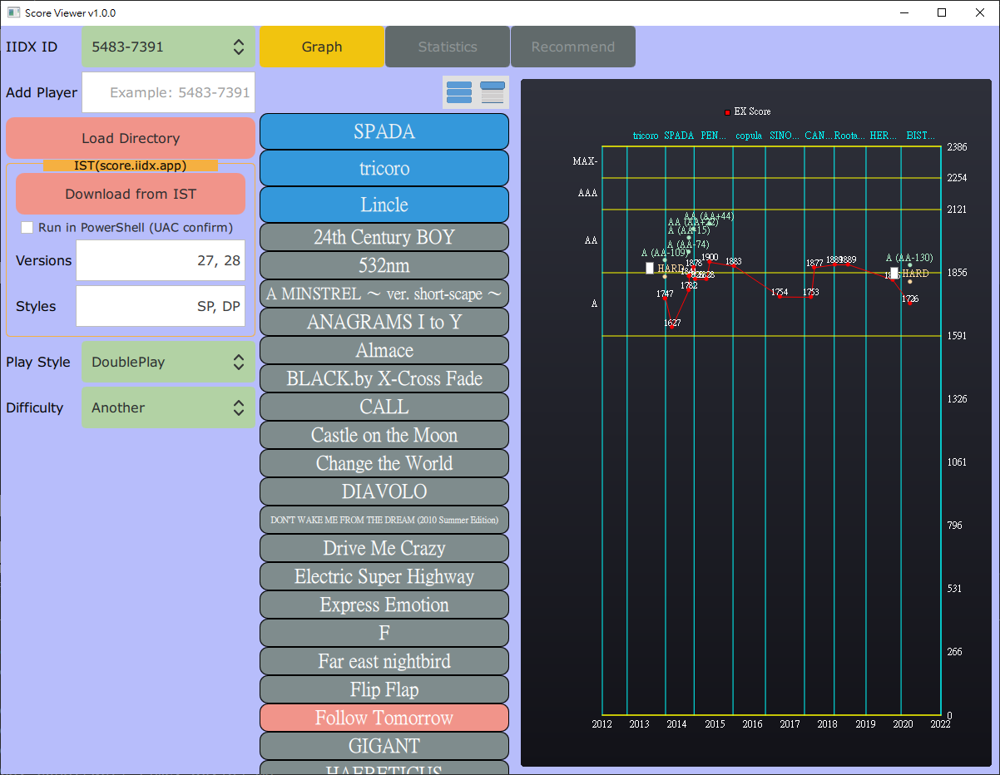

# Score2dx GUI

- GUI project utilize [score2dx library](https://github.com/blazar0112/score2dx) and visualize player's score.

## Important Notice

- You should only scrap IST once in a while for your data and load export data only afterwards.
- Do not use this to scrap IST frequently and/or massive scrap other's data.

## Features

- Graph: player historic score curve.

## Screenshot

## How to use

- Add Player: for use `Download from IST` without existing CSV to `Load Directory`.
    - Input IIDX ID and enter to add to IIDX ID list.

- Load Directory: load directory named in IIDX ID, e.g. `5483-7391`.
    - Release provide `Example/5483-7391` to test how to load directory.
    - Directory can contain many CSV files:
        - e.g. `5483-7391_dp_score_2020-11-21.csv`
    - Directory can contain export files:
        - e.g. `score2dx_export_DP_2021-09-12.json`
    - Automatic add player of that IIDX ID to list.

- Download from IST:
    - Download (scrap) IST data of player (current selected IIDX ID).
        - Requirement:
            - Chrome installed in `C:\Program Files`
            - Chrome version same as `chromedriver.exe`.
            - Current release bundle with chromedriver v94.
                - Download from official site to match your Chrome version if needed.
        - Options: specify versions and styles to download.
        - Default is verions: `27, 28` and styles: `SP, DP`.
        - Better modify to IST avaiable verions and style.
            - Check IST website to know what versions IST have data for you.
            - Also for styles, e.g. if you only have SP data, modify to SP.
        - Takes some time to start ist_scraper. Be patient.
        - Takes about 5min per one version one style.
        - Run in powershell can help to read output of `ist_scraper.exe`.
        - Currently Graph will not update automatically after download complete, manual select music to update.
        - Downloaded data is exported to `IST/<IIDX_ID>` directory.
        - You can just `Load Directory` that directory afterwards, no need to download everytime.

- Graph:
    - Click version folder (blue one) to expand or collapse musics.
        - Right top buttons: Collapse All/Expand All.
        - Expand All also centers current selected music.
    - Click music to view score curve (if have data).
        - Arrow key Up/Down to move up and down.
        - PageUp/Down to jump 5 music.
    - Select Style and Difficulty from left side.
