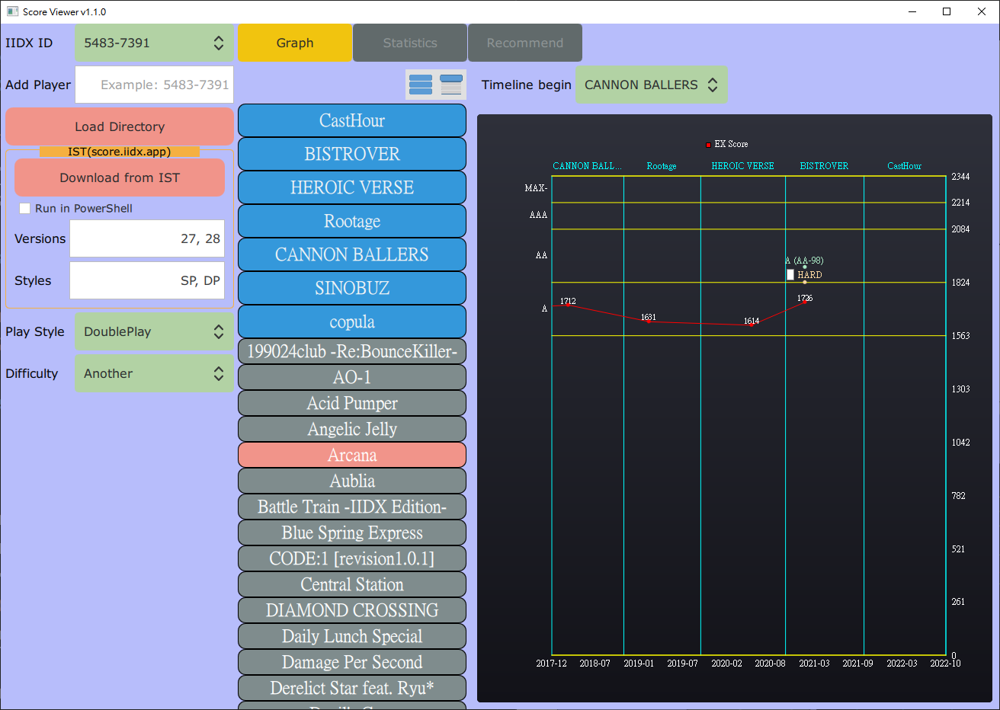

  <a href="/doc/README_zh-TW.md">繁體中文 (Taiwanese Mandarin)</a>

# Score2dx GUI

- Score2dx GUI is a GUI project utilize [score2dx](https://github.com/blazar0112/score2dx) library and visualize player's IIDX score.
- Score2dx GUI product:
    - ScoreViewer tool.

## Screenshot

## Requirement
- Windows 10.

## How to use
- If you have Konami CSV files downloaded:
    - Download CSV requires purchasing e-amusement premium course subscription.
    - [IIDX 29 CSV download link](https://p.eagate.573.jp/game/2dx/29/djdata/score_download.html).
    - Gather CSV files in a directory.
        - Directory must be named as IIDX ID.
            - For example: `5483-7391`.
        - CSV file have last changed date time of your score data for each music.
            - Recommend to get one CSV per month to make **Graph** appealing.
        - Default filename is like `5483-7391_dp_score.csv`.
            - To manage CSV files in one directory, recommend to rename and add date after `_score`.
            - Example: `5483-7391_dp_score_2020-11-21.csv`.
    - Click **Load Directory** and select above directory.
        - **Graph** shows your score curve chart.
        - Check [GUI Manual](#GUI-Manual) for detail.
    - Release provides example data in directory `Example/5483-7391` to test load directory.
- If you don't have CSV and do not want to buy premium service, you can alternatively:
    - Download previous data from [IIDX Score Table (IST)](https://score.iidx.app/) (if you have used IST).
        - Or start using IST from now:
            - Use [javascript](https://score.iidx.app/helps/usage) provided by IST to fetch your data from e-amusement site to IST.
            - Even better if you have synced with [IIDX ME](https://iidx.me/) before, which stopped providing score data service.
            - Notice that IST only keep best data of each IIDX version.
                - CSV approach can preserve score changes in a version.
    - How to download from IST using ScoreViewer:
        - Check [download from IST requirements](#Download-from-IST-requirements) before running script.
        - Input your IIDX ID in right side of **Add Player**, and press `Enter` to add to **IIDX ID** list.
        - Input versions and styles of your data, comma-separated.
            - Default **Versions** is `27, 28`, you can modify versions showed in your IST user page.
                - [Example User Page](https://score.iidx.app/users/5483-7391), in this case modify to `26, 27, 28`.
            - Default **Styles** is `SP, DP`, you can modify if you only want one style's data.
        - Click **Download from IST** to download current selected IIDX ID data from IST.
            - It runs in background.
                - Button is disabled during download.
            - Recommend to use **Run in PowerShell** mode, which will pop a PowerShell window executing `ist_scraper.exe`, shows progress and close after finish so you can know download is completed.
            - Takes about 1 minute to start the background download executable.
            - Take about 5 minutes per version-style to download data (intended delay to not be recognized as attacking IST).
                - Faster if you have fewer data.
                - For example: using default setting, `27, 28` and `SP, DP`, takes about 20 minutes to download.
            - After download you can view it in **Graph**.
            - Also export data to subdirectory `IST/<IIDX_ID>` as score2dx export Json format, named as `score2dx_export_SP_2021-09-14_IST_28.json`.
                - You can just **Load Directory** that directory later, no need to download again.
- Data is combined from all sources:
    - For example:
        - Have synced IIDX ME to IST during 24.
        - Used IST javascript during 26, 27, 28 before.
        - Use ScoreViewer to download from IST with **Versions** = `24, 26, 27, 28`.
        - Use ScoreViewer to load 29 CSV.
        - **Graph** should display 24 to 29 curve.

## Important Notice

- Be polite to IST website:
    - You should only download IST once in a while for your data and only load export data afterwards if you can use CSV approach.
    - Do not use this to scrap IST frequently and/or massive scrap other's data.

## Download from IST requirements

- Using Python script packed as `ist_scraper.exe` to drive Chrome to scrap IST website data and assumed following requirements:
    - Chrome browser installed in `C:\Program Files`.
    - Chrome browser version same as chromedriver.
        - `ist_scraper.exe` will check version for you, you can see if version mismatch in PowerShell mode.
    - Current release bundle a v94 `chromedriver.exe`.
        - Download chromedriver from [official download](https://chromedriver.chromium.org/downloads) and to match your Chrome version if needed, since Chrome may update or you did not update your Chome.
            - Replace matched `chromedriver.exe` with bundled one in same directory of `ScoreViewer.exe`.

## GUI Manual
- Green background ComboBox: click and select items in dropdown menu.
    - **IIDX ID**
    - **Play Style**
    - **Difficulty**
    - **Timeline begin**
- **IIDX ID** list:
    - Current loaded players, identified by IIDX ID.
    - IIDX ID format: `5483-7391`.
    - Selected IIDX ID is current player, used in **Download from IST** and **Graph**.
    - **Add Player** can manually add IIDX ID to list.
        - GUI allows you to input without dash `-`.
        - Press `Enter` to input, if format is correct the input field is cleared.
    - After **Load Directory**, automatically add loaded directory to list, because the directory must be named as IIDX ID.
        - So you do not need to manually **Add Player** while load with existing data.
- **Load Directory**:
    - Load score data from directory named as IIDX ID.
    - Score data is parsed from files inside directory:
        - CSV files, e.g. `5483-7391_dp_score_2020-11-21.csv`.
            - Any character between `_score` and `.csv` is ignored, so you can use this to annotate CSV.
        - Export files, e.g. `score2dx_export_SP_2021-09-14_IST_28.json`.
- **Download from IST**:
    - Already covered in [How to use](#How-to-use).
- **Graph**:
    - Use left side **Play Style** and **Difficulty** to select style-difficulty data.
    - Selecting music:
        - Click **Version Folder** (cyan color button) to expand and collapse musics inside that version.
        - `Wheel up` and `Wheel down` to scroll version folders.
        - Above version folders, right top two buttons:
            - **Collapse All Versions**, left one.
            - **Expand All Versions**, right one.
                - Expand all also centers current selected music.
        - Current selected music: pinkish background.
        - Click unselected music (gray background) to select music.
            - Can also use key to navigate:
                - `Arrow Up` to jump one music upwards.
                - `Arrow Down` to jump one music downwards.
                - `Page Up` to jump 5 music upwards.
                - `Page Down` to jump 5 music downwards.
                - It's circular from top-most to down-most.
                    - But current GUI implementation may have bug sometimes when jump from top-most to down-most, musics will go out of display range.
                    - Click **Expand All Versions** to workaround in this case, should center correctly.
    - Score chartview:
        - X axis: timeline of score.
            - Top separate axis by each version.
            - Bottom denotes year-month of 1/10 axis.
        - Y axis: EX score value.
            - Right side denotes score value for each DJ level.
        - Red point and curve line:
            - X: Date time.
            - Y: EX score value with white label.
        - If score is updated or is latest, add indicator above score point:
            - Update means better than previous data in any of `clear, EX score, DJ level`.
            - Clear: yellow dot above with clear lamp and clear type text.
            - Score: green dot above with DJ level text and difference from closest DJ level.
                - For example: `AA(AA+2)`.
        - **Timeline begin**: select chartview begin version, so timeline matches your data properly.
            - Default version: `IIDX 23 copula`, earliest of CSV service.
            - Selectable range: `IIDX 17 SIRIUS` to `IIDX 28 BISTOVER`.
