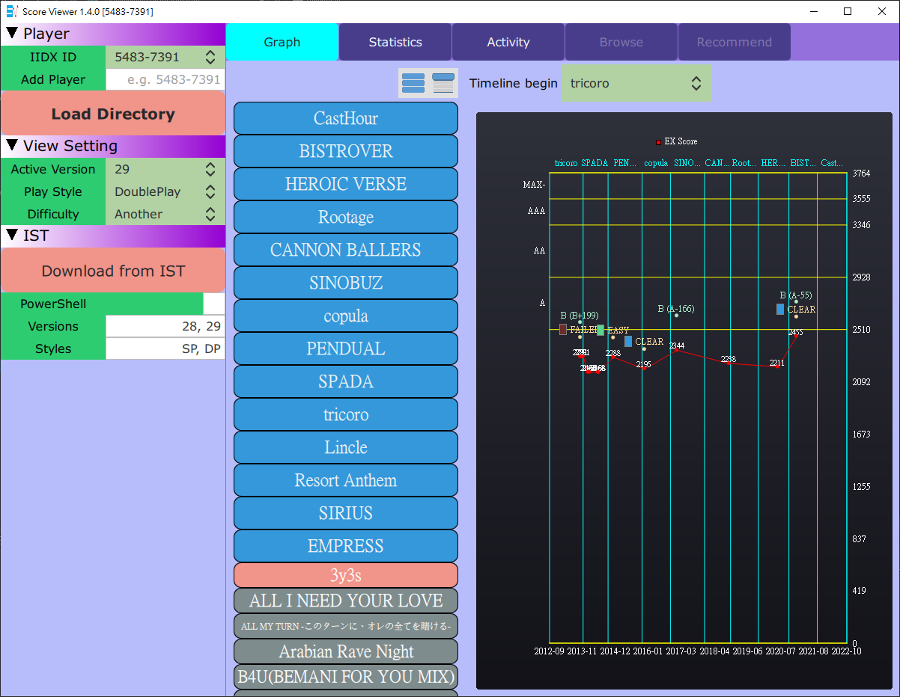
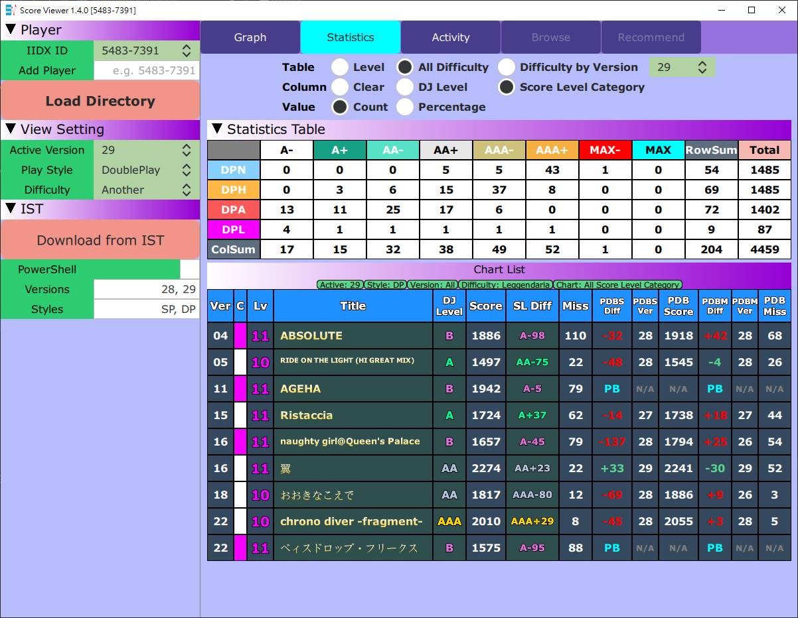
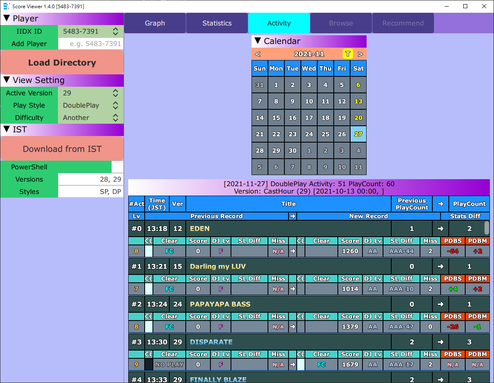

# Score2dx GUI

- Score2dx GUI 是使用 [score2dx](https://github.com/blazar0112/score2dx) 函式庫分析與視覺化 IIDX 玩家 CSV 分數成績的圖形使用者介面專案。
- Score2dx GUI 產品：
    - ScoreViewer 工具。

## 螢幕截圖

## 需求

- Windows 10。

## 使用方式

- 如果你手邊已經有 Konami CSV 檔案：
    - 下載 CSV 檔案需要購買 e-amusement 的高級會員(プレミアムコース)。
    - [IIDX 29 CSV 下載頁面](https://p.eagate.573.jp/game/2dx/29/djdata/score_download.html)。
    - 將 CSV 檔案放在同一個資料夾。
        - 資料夾名稱必須跟 IIDX ID 一樣。
            - 例如：`5483-7391`。
        - CSV 檔案內會有你每一首歌曲的最後更新資料。
            - 建議每個月固定下載 CSV 存檔，才能讓 **Graph** 功能發揮。
        - 預設檔名是像：`5483-7391_dp_score.csv`.
            - 為了能在同一個資料夾內放不同的 CSV 檔案，建議在檔名中 `_score` 後面加上下載的日期。
            - 例如：`5483-7391_dp_score_2020-11-21.csv`。
    - 點 **Load Directory** (讀取資料夾)按鈕並且選取上述資料夾。
        - **Graph** (圖表)會顯示你的分數折線圖。
        - 請看 [GUI 操作手冊](#GUI-操作手冊) 了解更多使用細節。
    - 發布版本內有提供範例資料夾 `Example/5483-7391` 提供測試讀取資料夾功能。
- 如果你沒有 CSV 檔案，也不想購買高級會員，有下面的替代方案：
    - 從 [IIDX Score Table (IST)](https://score.iidx.app/) 下載現有資料夾(如果你有在使用IST)。
        - 或者從現在開始使用 IST：
            - 使用 IST 提供的 [javascript](https://score.iidx.app/helps/usage) 從 e-amusement 網站讀取資料到 IST 中。
            - 如果你曾經利用 IST 同步過已經停止服務的成績網站 [IIDX ME](https://iidx.me/) 的話更好。
            - 注意 IST 只會保留每個 IIDX 版本的最佳成績。
                - 使用 CSV 的話則會保留版本中的變動。
    - 如何使用 ScoreViewer 從 IST 下載資料：
        - 在執行腳本前先檢查滿足 [下載 IST 需求](#下載-IST-需求)。
        - 在 **Add Player** 的右方輸入你的 IIDX ID，然後按下 `Enter` 以加入至 **IIDX ID** 名單。
        - 設定下載的版本名單與遊玩風格名單，以逗號隔開。
            - 預設 **Versions** (版本名單)為 `28, 29`，你可以編輯成 IST 使用者頁面中顯示有資料的版本名單。
                - [範例使用者頁面](https://score.iidx.app/users/5483-7391)，在這例子中可以改為 `26, 27, 28`。
            - 預設 **Styles** (遊玩風格名單)為 `SP, DP`，如果你只想要其中一種，也可以編輯名單。
        - 點 **Download from IST** (從 IST 下載)按鈕，根據目前的 IIDX ID 玩家來從 IST 下載資料。
            - 會在背景執行。
                - 下載中會將按鈕停用。
            - 建議使用 **Run in PowerShell** (在 PowerShell 中執行)模式，如此會新開一個 PowerShell，執行腳本 `ist_scraper.exe`。會顯示進度並且完成後會自動關閉，如此便可得知下載完成。
            - 需要大概 1 分鐘才能啟動背景下載腳本。
            - 每個 版本-遊玩風格 需要約 5 分鐘下載全部資料 (是為了避免被認為攻擊 IST 刻意加上的延遲)。
                - 如果你的資料量沒那麼多的話當然會快一點。
                - 例如：使用 `27, 28` 與 `SP, DP` 設定，需要約 20 分鐘下載。
            - 下載完成後就可以馬上在 **Graph** 看到。
            - 也同時會匯出資料成 score2dx 匯出 Json 格式至 `IST/<IIDX_ID>` 子資料夾中，檔名如 `score2dx_export_SP_2021-09-14_IST_28.json`。
                - 之後可以直接 **Load Directory** 該資料夾，不用再重新下載。
- 從不同來源的資料均會被合併：
    - 範例：
        - 在 24 代的時候曾經同步 IIDX ME 至 IST。
        - 在 26, 27, 28 的時候用過 IST javascript 讀取資料。
        - 使用 ScoreViewer 從 IST 下載，設定 **Versions** = `24, 26, 27, 28`。
        - 使用 ScoreViewer 讀取 29 CSV。
        - **Graph** 就會顯示合併的 24 至 29 折線圖。

## 重要提醒

- 保持對 IST 網站的禮節：
    - 你應該只偶爾從 IST 下載過往資料，如果你現在能用 CSV 方式的話，可以直接讀取下載的資料跟 CSV，而不應該再執行下載。
    - 請勿使用此工具頻繁下載自己或者大量下載他人的資料。

## 下載 IST 需求

- 下載是執行包裝成 `ist_scraper.exe` 的 Python 腳本來驅動 Chrome 爬取 IST 網站資料，因此有下面需求/假設：
    - Chrome 瀏覽器安裝在 `C:\Program Files`。
    - Chrome 瀏覽器的版本必須跟 chromedriver 一致。
        - `ist_scraper.exe` 會幫你檢查版本有無一致，可在 PowerShell 模式中得知。
    - 目前發布版本內附上 v96 的 `chromedriver.exe`.
        - 如果你的版本不一致，從 [官方下載頁面](https://chromedriver.chromium.org/downloads) 下載版本一致的 chromedriver，因為 Chrome 可能日後會需要更新，或者你使用未更新的 Chrome 版本。
            - 把跟 `ScoreViewer.exe` 同資料夾中附的 `chromedriver.exe` 取代成下載的 `chromedriver.exe`。

## GUI 操作手冊

- 有三角形 `▼` 的紫色介面區塊條: 點區塊條可以摺疊下方區塊。
- 綠色背景的 ComboBox (下拉式組合方塊)： 點了後從下拉式選單中選取。
    - **IIDX ID**
    - **Play Style** (遊玩風格)
    - **Difficulty** (譜面難易度)
    - **Timeline begin** (時間軸起點)
- **IIDX ID** 名單:
    - 顯示目前讀取的玩家，以 IIDX ID 區隔玩家。
    - IIDX ID 格式：`5483-7391`。
    - 選取的 IIDX ID 是當前玩家，會用在 **Download from IST** 與 **Graph** 功能中。
    - **Add Player** (加入玩家) 可以手動加入 IIDX ID 至名單內。
        - 程式也可接受無 `-` 的輸入。
        - 輸入完按下 `Enter`，如果格式正確就會加入名單並且清空輸入框。
    - 在 **Load Directory** 後會自動加入該資料夾的 IIDX ID 至名單內。
        - 所以用讀取資料夾讀取現有資料的話就不需使用 **Add Player**。
- **Load Directory** (讀取資料夾)：
    - 從與 IIDX ID 同名的資料夾中讀取分數資料。
    - 分數資料從資料夾中的檔案讀取：
        - CSV 檔案，如 `5483-7391_dp_score_2020-11-21.csv`。
            - 任何在 `_score` 與 `.csv` 之間的字元均被忽略，所以可以用此來標註 CSV。
        - 匯出(Export)檔案，如 `score2dx_export_SP_2021-09-14_IST_28.json`。
    - 目前不支援萬國碼檔名，請只用英文數字與系統允許的 ASCII 符號命名檔案。
- **View Setting** (查看設定):
    - 會影響多處的設定:
        - **ActiveVersion** (啟用版本): 影響 Statistics(統計), 選擇啟用版本會從當時的歌曲資料中統計。
        - **Play Style** (遊玩風格): 影響 Graph(圖表)與 Statistics(統計)。
            - 可以按下 `S鍵` 或 `D鍵` 用鍵盤切換 SP/DP。
        - **Difficulty** (譜面難易度): 只影響 Graph(圖表)。
- **Download from IST** (從 IST 下載)：
    - 已在 [使用方式](#使用方式) 中說明。

- **Graph** (圖表)：

    - 用左側的 **Play Style** (遊玩風格)與 **Difficulty** (譜面難易度)選擇對應的分數資料。
    - 選擇歌曲：
        - 點 **Version Folder** (版本資料夾，天藍色按鈕)可以展開與關閉該版本的歌曲。
        - 用 `Wheel up` (滑鼠滾輪往上)與 `Wheel down` (滑鼠滾輪往下)來捲動版本資料夾。
        - 在版本資料夾右上角有兩個小按鈕：
            - 左邊的是 **Collapse All Versions** (關閉全部版本)。
            - 右邊的是 **Expand All Versions** (展開全部版本)。
                - 展開全部也同時會自動捲動選擇的歌曲至中央。
        - 目前選擇的歌曲：粉紅背景。
        - 點未選擇的歌曲(灰色背景)來選擇歌曲。
            - 也可以用鍵盤的方式來瀏覽選擇：
                - `Arrow Up` (方向鍵上)選擇上一首。
                - `Arrow Down` (方向鍵下)選擇下一首。
                - `Page Up` (頁面鍵上)往上跳選五首。
                - `Page Down` (頁面鍵下)往下跳選五首。
                - 可以循環式從最上方往上跳至最下方歌曲。
                    - 但是目前實作有 bug，有時候這樣跳動時會將所有歌曲超出可視範圍。
                    - 可點 **Expand All Versions** (展開全部版本)並將超出可視範圍歌曲重新至中暫時解決。
    - 分數圖表：
        - X 軸：分數時間軸。
            - 上方根據各版本時間分隔。
            - 下方將時間軸 10 等分對應的 年-月 列出。
        - Y 軸：EX 分數值。
            - 右方列出各 DJ level 對應的分數。
        - 紅色的點與折線圖：
            - X: 日期時間。
            - Y: EX 分數值用白色文字表示。
        - 如果分數有更新或者是最後的分數，則會在分數點上方加上標示:
            - 更新是指 `clear, EX score, DJ level` 中只要有任何一項比之前歷史更高。
            - Clear: 上方加上黃色的點與燈號還有 clear 種類文字。
            - Score: 上方加上綠色的點與 DJ level 文字，還有與最近 DJ level 的差分。
                - 例如： `AA(AA+2)`。
        - **Timeline begin** (時間軸起點)：選擇圖表時間開始的版本，可讓時間軸更契合你的資料：
            - 預設時間起點版本： `IIDX 23 copula`，最早有 CSV 服務的版本。
            - 可以選的起點版本範圍： `IIDX 17 SIRIUS` 至 `IIDX 28 BISTOVER`。

- **Statistics** (統計)：

    - 呈現統計數字表，會由下列因素影響：
        - ActiveVersion (啟用版本)
        - Table (表格)
        - Column (欄)
        - Value (數值)
    - 統計表格額外統計每列與每欄的總數 (RowSum 列總和/ ColSum 欄總和)
    - Total (總數)欄列出總譜面數。
    - Active version (啟用版本)：只從該版本的時間點統計資料。
        - 同時考慮玩家資料時間點與該版本可玩的樂曲與譜面。
    - Table (表格)：選擇每列分類與資料來源
        - Level (等級)：
            - 列從等級 1 至等級 12。
        - All difficulty (全難易度)：
            - 列為每個難易度(Beginner除外)。
        - Difficulty by Version (各版本難易度)：
            - 列為每個難易度(Beginner除外)。
            - 表格只統計選擇版本的歌曲。
    - Column (欄)：選擇每欄分類種類
        - Clear (過關種類)：
            - NO PLAY
            - FAILED
            - ASSIT
            - EASY
            - CLEAR
            - HARD
            - EX HARD
            - FC
        - DJ Level (官方DJ level)：
            - F
            - E
            - D
            - C
            - B
            - A
            - AA
            - AAA
        - Score Level Category (分數等級分類):
            - A-
            - A+
            - AA-
            - AA+
            - AAA-
            - AAA+
            - MAX-
            - MAX
    - Value (值)：選擇表格內值的類型
        - Count (數量)
        - Percentage 百分比(除以列總譜面數)
- **Statistics Table** (統計表格)
    - 可以點標題 `Statistics Table` 橫條展開/關閉表格(來看到譜面清單更多列)。
    - 點非零數值的白底格子可以在譜面清單中顯示所有相關譜面。
- **Statistics Chart List** (統計譜面清單)
    - 顯示所有過濾的譜面分數資訊。
    - 在標題 `Chart List` 中用綠色標籤顯示目前的過濾條件。
    - 譜面清單欄位：

        | 欄位 | 說明 | 註解 |
        | - | - | - |
        | Ver | 譜面歌曲的版本(Version)。 | |
        | C | 以燈號顯示的過關類型(ClearType)`. | |
        | Lv | 譜面的等級(Level)。 | |
        | Title | 譜面歌曲的曲名(Title)。 | |
        | DJ Level | 譜面分數的 DJ 等級(DJ level)。 | 如果 `NO PLAY` 預設成 `F`。 |
        | Score | 譜面的分數(EX Score)。 | 如果 `NO PLAY` 預設成 `0`。 |
        | SL Diff | 譜面的分數等級(Score Level)與實際差距值。 例如 `MAX-20` | 如果 `NO PLAY` 預設成 `NP`。 |
        | Miss | 譜面成績的失誤數(Miss count)。 | 如果 `NO PLAY` 預設成 `N/A`。 |
        | PDBS Diff | 與 `Personal Diffable Best Score` (個人可差別最佳分數)的差距值(Diff)，PDBS 為最佳或者次佳分數(如果目前分數是個人最佳)。 | 如果 `NO PLAY` 預設成 `NP`。如果沒有任何可取得 PDBS 紀錄的話設成 `PB`。 如果成績較佳(`+`, 上升)用綠色上色，如果成績較糟(`-`, 下降)用紅色上色。 |
        | PDBS Ver | `Personal Diffable Best Score` (個人可差別最佳分數)紀錄時間的版本(Version)(並非歌曲版本)。 | 如果沒有任何可取得 PDBS 紀錄的話設成 `N/A`。 |
        | PDB Score | `Personal Diffable Best Score` (個人可差別最佳分數)的數值。 | 如果沒有任何可取得 PDBS 紀錄的話設成 `N/A`。 |
        | PDBM Diff | 與 `Personal Diffable Best Miss` (個人可差別最佳失誤數)的差距值(Diff)，PDBM 為最佳或者次佳失誤數(如果目前失誤數是個人最佳)。 | 如果 `NO PLAY` 預設成 `NP`。如果沒有任何可取得 PDBM 紀錄的話設成 `PB`。 如果成績較佳(`-`, 下降)用綠色上色，如果成績較糟(`+`, 上升)用紅色上色。 |
        | PDBM Ver | `Personal Diffable Best Miss` (個人可差別最佳失誤數)紀錄時間的版本(Version)(並非歌曲版本)。 | 如果沒有任何可取得 PDBM 紀錄的話設成 `N/A`。 |
        | PDB Miss | `Personal Diffable Best Miss` (個人可差別最佳失誤數)的數值。 | 如果沒有任何可取得 PDBM 紀錄的話設成 `N/A`。 |

        - 附註：`可差別`的意思是數值上必須要有差異值，所以同數值的其他紀錄會被忽略，因此有可能找不到可差別的紀錄。

- **Activity** (活躍)：

- **Calendar** (日曆)
    - 點選日期觀看活躍內容。
    - 有活躍的日期會以黃字標示。
    - 切換啟用版本或直接跳至該版本開始日期。
    - **按鈕 <**: 跳至上個月。
    - **按鈕 >**: 跳至下個月。
    - **按鈕 T**: 跳至今日。
    - 點選不在版本內的日期可能還是有活躍內容。
        - 但可能不會跟正確的個人最佳成績比較。
        - 樂曲/譜面可能被刪除/復活/新增，啟用版本不對則無法正確包含對應樂曲/譜面。
        - 請設定啟用版本並選取版本內的黃色日期。

- **Activity List** (活躍清單)
    - 顯示選取日期的樂曲活躍內容。
    - Activity (活躍)：樂曲更新時間在選取日期內。
        - 樂曲可能有多個譜面更新，但只列為同一樂曲活躍。
    - 活躍時間為 CSV 或匯入資料中的更新時間，請注意並無法反映真實遊玩歷史：
        - 例如：
            - 同一樂曲玩了六次，CSV 只會列出最後更新時間。
            - 在同一日中下載了兩個時間點的 CSV，樂曲就可能會出現在清單中兩次，分別為 CSV 中的更新時間點。
    - Play Count (遊玩次數)：樂曲遊玩次數，**並非** 玩家遊玩次數(道數/打數)。
        - CSV 只有記錄各樂曲遊玩次數。
        - 可以除以四來大致估計玩家遊玩次數。
    - 如果資料從 IST 下載：日期時間會是執行腳本時間，遊玩次數會是零。
    - New Record (新紀錄)：只會列出有更新的欄位。
    - PDBS/PDBM diff：與統計中的欄位相同，請看 **統計譜面清單** 的說明。
